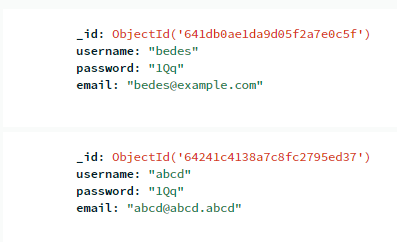
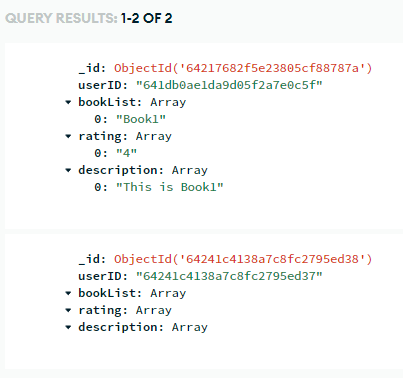

# W-10 RestAPI

## API Docs
-MockAPI: https://documenter.getpostman.com/view/26585922/2s93RTRsZH

-MongoDB + Express: https://documenter.getpostman.com/view/26585922/2s93RTRshy

## MongoDB Database Structure

- Collection : Users
  -  Database: books_collection, user_login

user_login used for check user in login page, create a new table in books_collection if any user signed up. books_collection id is same of the user_login.

## Sites

mockAPI : https://w10-yankyhermawa.netlify.app

## Notes
I'm haven't create handler for invalid email or password.

In command prompt:
```
cd mongoDB

nodemon
```
For better experience in using my mongoDB app (already set up for connection/server)

Default account:



Default Book Data:


